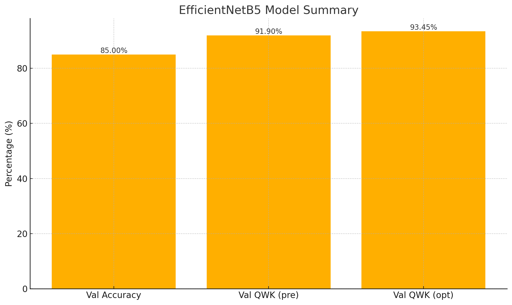

# OptIDR – Early Detection of Diabetic Retinopathy (DR) with Explainable AI

*OptIDR* combines cutting-edge deep learning with intuitive explainability to detect DR severity (0–4) from retinal fundus images, delivered via a Streamlit web demo. Early diagnosis can prevent up to 95% of vision loss—crucial for communities with limited ophthalmology access.

---

## 🩺 Problem Statement
Diabetic retinopathy (DR) is the leading cause of adult blindness worldwide. Regular screenings are scarce in underserved areas, delaying intervention and increasing irreversible vision loss.

## 🚀 Solution Overview
- *Web Demo (Streamlit):* Upload a fundus image ➔ get a DR stage prediction + explainable heatmap + triage recommendation.
- *Models Developed:*
  - *EfficientNetB5 (Keras):* achieves 85% validation accuracy, Cohen’s QWK pre-optimization 0.9190 → post-optimization 0.9345.
  - *ResNeXt50 (PyTorch):* reaches 83% validation accuracy and converges in 16 epochs (best val loss 0.1744).

---

## 🔑 Key Features
1. *AI-Driven Diagnosis*  
   - Transfer-learned CNNs (EfficientNetB5, ResNeXt50) fine-tuned on APTOS 2019.  
2. *Explainability (Grad-CAM)*  
   - Visual heatmaps highlight retinal lesions driving each prediction.  
3. *Risk Triage*  
   - Automated referral advice (e.g., "High risk: specialist within 1 week").  
4. *Low-Bandwidth Ready*  
   - Model quantization/pruning for efficient inference in constrained settings.  
5. *User-Friendly UI*  
   - Streamlit interface for instant upload → classify → visualize workflow.

---

## 🛠 Tech Stack
| Component        | Technology                        |
|------------------|-----------------------------------|
| Model Training   | TensorFlow (Keras) / PyTorch      |
| Explainability   | OpenCV, Grad-CAM                  |
| Web Demo         | Streamlit                         |
| Optimization     | TensorFlow Lite (quantization), ONNX |

---

## 📈 Model Performance Summary
| Model                  | Val Accuracy | Val QWK (pre) | Val QWK (opt) | Convergence (epochs) | Params (M) | Best Val Loss |
|------------------------|-------------:|--------------:|--------------:|----------------------:|-----------:|--------------:|
| EfficientNetB5 (Keras) |       85.00% |        0.9190 |        0.9345 |                   35  |         30 |         0.033  |
| ResNeXt50 (PyTorch)    |       83.00% |        0.8912 |        0.9215 |                   16  |         25 |        0.1744 |

---

## 📄 License
MIT © NEXUS
